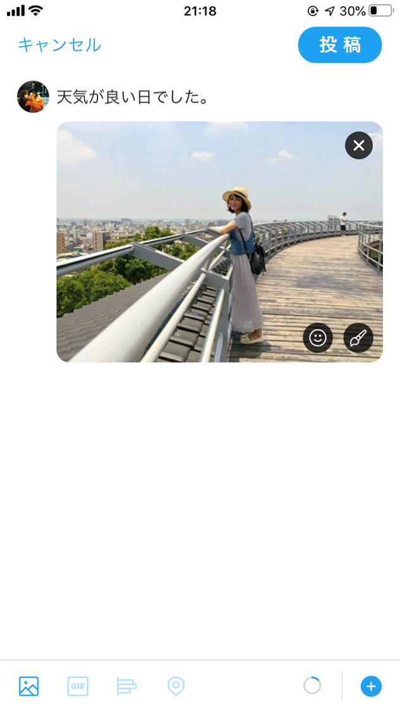

## プライバシー開示行動に関するシナリオと質問
これからSNSへの画像投稿に関するいくつかの質問をします．
以下のようなSNSアカウントを利用していることを想定して質問に回答してください.

フォロワー：300人，公開アカウント

下図ははあなたが投稿しようと試みている際のデバイスの画面です．
写真にはあなたが写っています．

  

     

 

このとき，あなたはこの投稿をしますか？（投稿する/投稿しない）