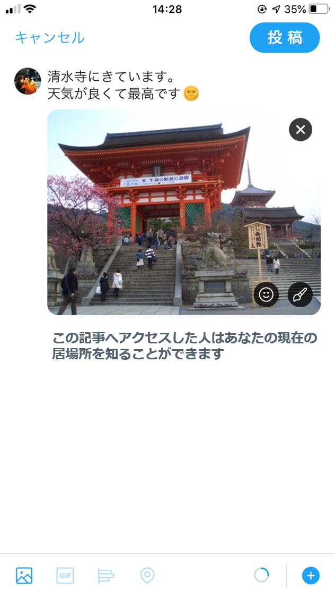

## プライバシー開示行動に関するシナリオと質問
これからSNSへの画像投稿に関するいくつかの質問をします．
以下のようなSNSアカウントを利用していることを想定して質問に回答してください.

フォロワー：300人，公開アカウント

あなたは現在京都へ観光にきており，観光名所の写真を撮影しました．
その後，撮影した写真をSNSへ下図のように投稿しようとしています．

  

     

 

このとき，あなたはこの投稿をしますか？（投稿する/投稿しない）

## メッセージに関する質問項目
- 投稿画像の下にメッセージが無いときに比べて，
    - より投稿のリスクを意識した
    - より投稿を閲覧できる第三者の存在を意識した
    - より投稿の内容がプライバシー情報であることを意識した
    - より他のユーザの行動を意識した

- (質問項目2で[投稿しない]と回答した人に対して）質問項目2で[投稿しない] を選んだ理由について当てはまるものを全て選択してください

（投稿する前に友達の許可をとろうと思った/投稿の公開範囲を制限しようと思った/投稿で公開する情報の項目（顔・位置情報等）を減らそうと思った/投稿するタイミングをずらそうと思った（後で投稿しようと思った）/その他）
- 1つ前の質問のように回答した理由を教えてください 
- 投稿時 写真の下に表示されたメッセージは投稿するか否かの判断材料になりましたか？
- 1つ前の質問のように回答した理由を教えてください