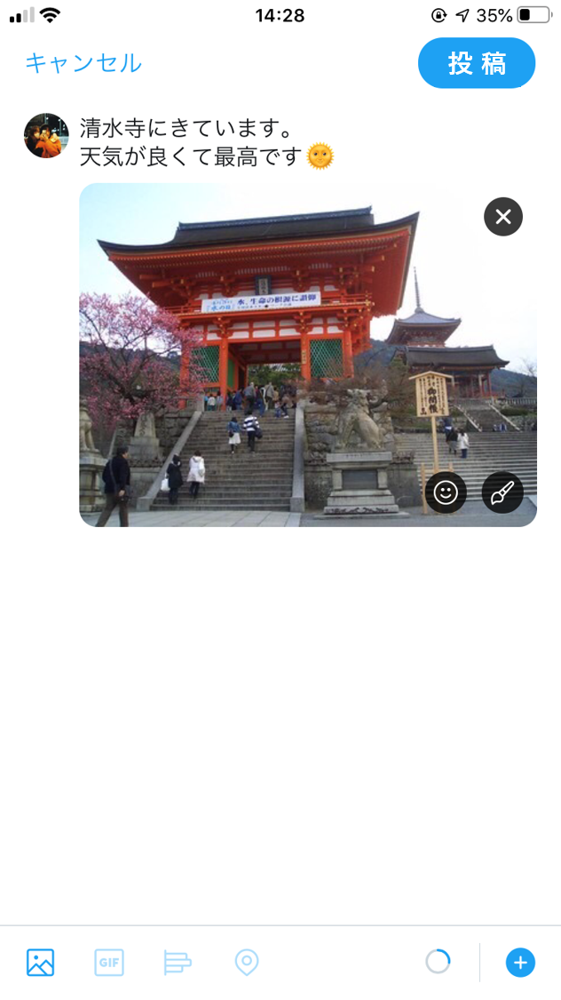

## プライバシー開示行動に関するシナリオと質問
これからSNSへの画像投稿に関するいくつかの質問をします．
以下のようなSNSアカウントを利用していることを想定して質問に回答してください.

フォロワー：300人，公開アカウント

あなたは現在京都へ観光にきており，観光名所の写真を撮影しました．
その後，撮影した写真をSNSへ下図のように投稿しようとしています．

  

     

 

このとき，あなたはこの投稿をしますか？（投稿する/投稿しない）