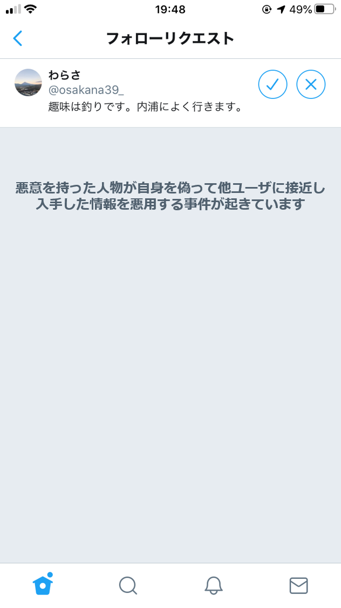

## プライバシー開示行動に関するシナリオと質問
これからSNSへの画像投稿に関するいくつかの質問をします．
以下のようなSNSアカウントを利用していることを想定して質問に回答してください.

フォロワー：300人，非公開アカウント

あなたのSNSアカウントにフォローリクエストがきています．

  

     

 

SNSで共通の趣味を持った人からフォローリクエストが来た場合，あなたはリクエストを許可しますか？（許可する/許可しない）

## メッセージに関する質問項目
- 許可画面にメッセージが無いときに比べて，
    - より許可のリスクを意識した
    - より許可によってあなたの投稿を閲覧できる第三者の存在を意識した
    - より許可によって相手が見れるあなたの投稿の内容がプライバシー情報であることを意識した
    - より他のユーザの行動を意識した
- 許可画面に表示されたメッセージは許可するか否かの判断材料になりましたか？
- 1つ前の質問のように回答した理由を教えてください