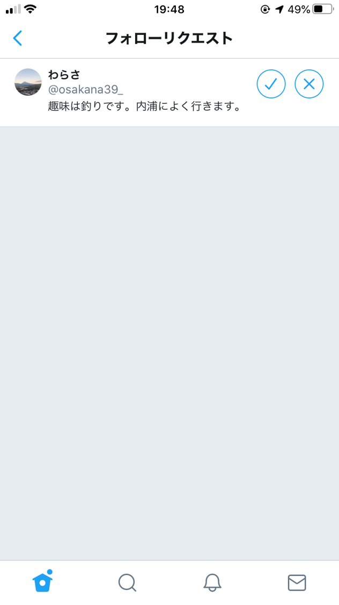

## プライバシー開示行動に関するシナリオと質問
これからSNSへの画像投稿に関するいくつかの質問をします．
以下のようなSNSアカウントを利用していることを想定して質問に回答してください.

フォロワー：300人，非公開アカウント

あなたのSNSアカウントにフォローリクエストがきています．

  

     

 

SNSで共通の趣味を持った人からフォローリクエストが来た場合，あなたはリクエストを許可しますか？（許可する/許可しない）